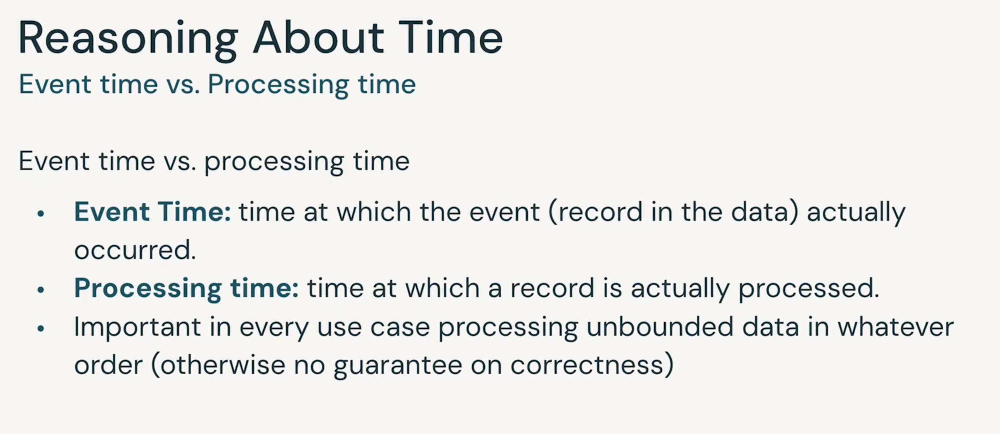
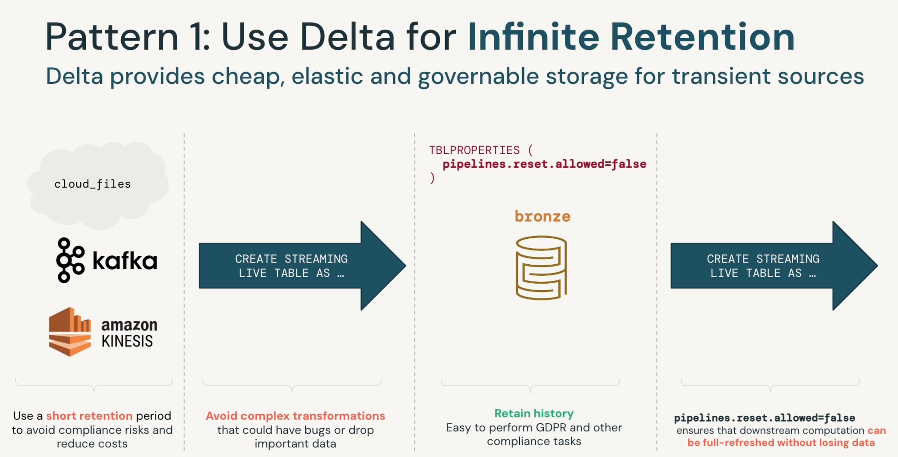
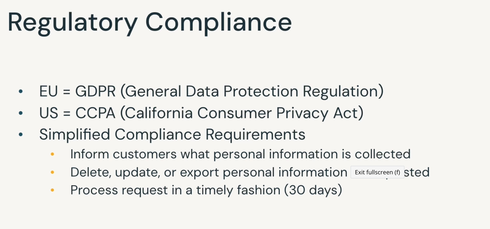

# Databricks Academy: Advanced Data Engineering with Databricks

## Module 1: Incremental processing with Spark structured streaming

### SubMod 1: Streaming Data Concepts

Streaming data - continuously generated and unbounded (infinite) data.  
  &emsp;  Typical data sources - clickstreams, application events, mobile & iot data

### SubMod 2: Introduction to Structured streaming

**Anatomy of Streaming Query**  
df = spark.readStream.format("kafka") .option("kafka.bootstrap.servers","....") .option("subscribe","topicName") .load()

**to transform the data after read. eg reading nested json**

**to write the streaming data to a defined path**

**to define the trigger as per requirement apart from default configs**

**different types of triggers**

**output mode to write to sink**

**Benefits of Structured Streaming**

**Structured Streaming with Delta Lake**

**Demo 1: Streaming**

**Aggregate, Time windows, & Watermarking**

## Module 2: Streaming ELT patterns with DLT

**Demo: Auto Loader**

**Demo 2: Streaming from Multiplex bronze**

**Data Quality enforcement patterns**

**Data Modelling**
Slowing changing dimensions in Lakehouse
 

**Demo: SCD**

**Streaming joins and Statefulness**

**Demo: Streaming static jobs**

## Module 3: Data security and goverance patterns

**secure data**

