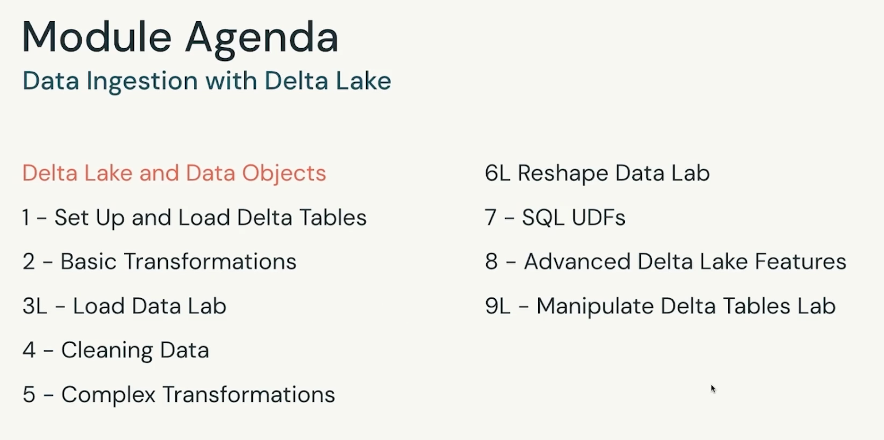
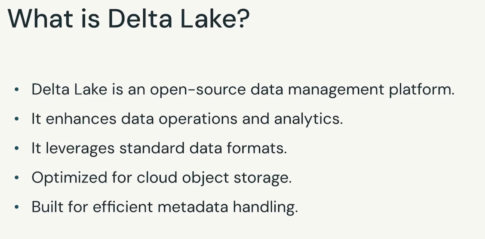
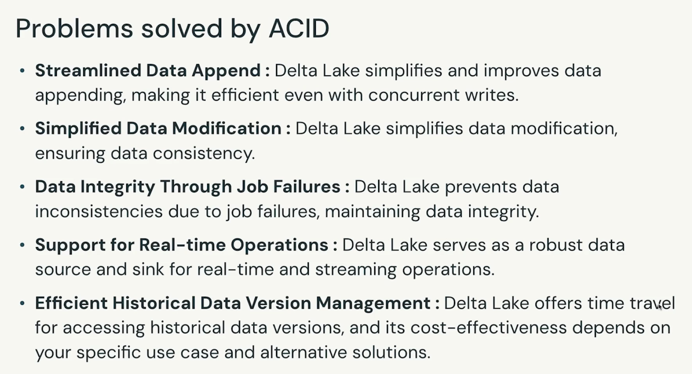
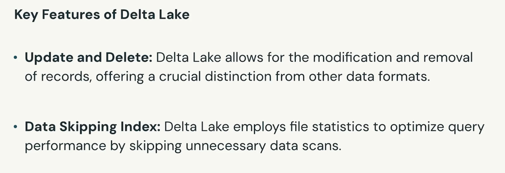
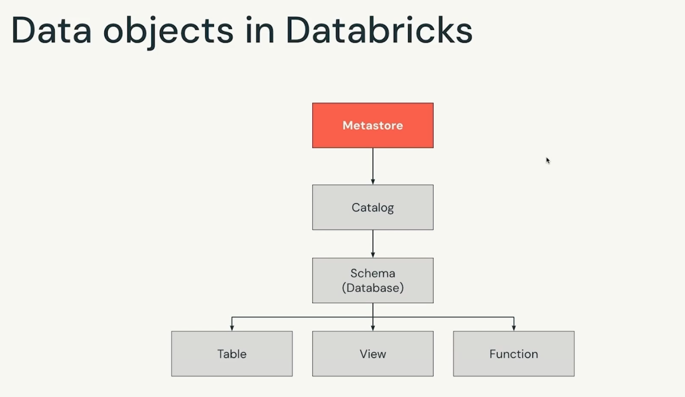
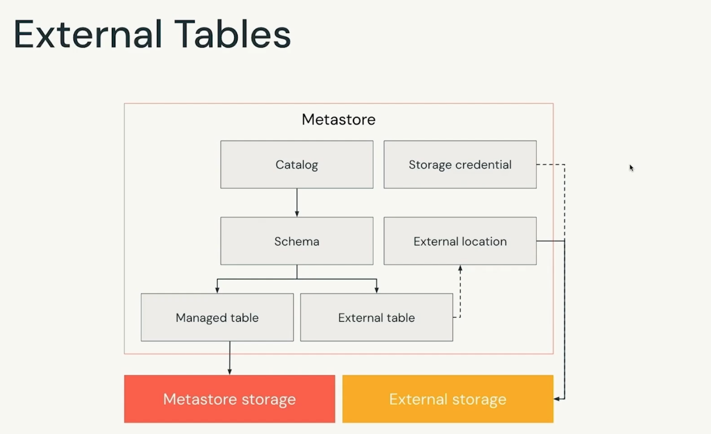
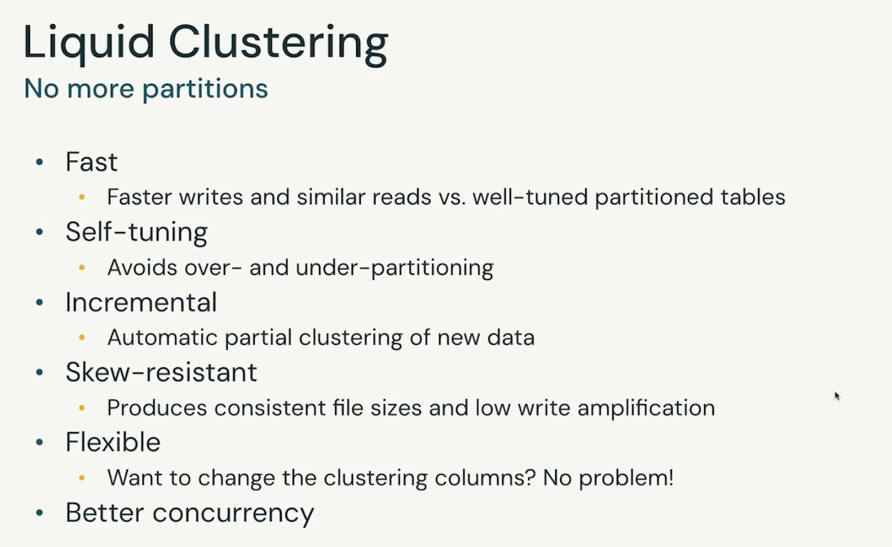
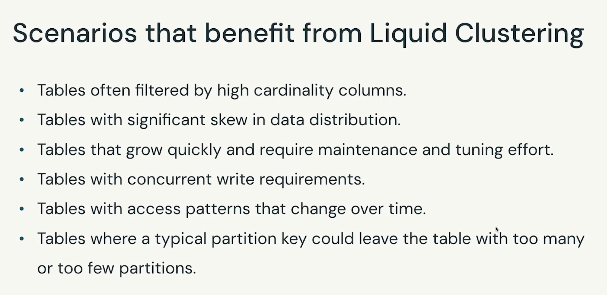
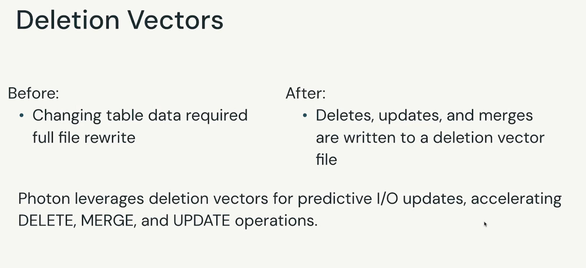
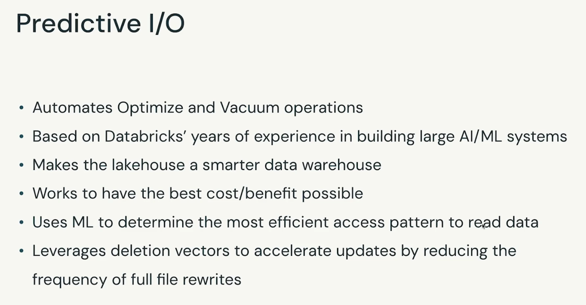

# Databricks leaning notes

## Databricks associate certification prep
**databricks partner academy**
### Module 1: Data Ingestion with Delta Lake

#### Module agenda

**Delta Lake - open-source project that enables building data lakehouse on top of an existing cloud storage

**delta lake is the default format for table created in databricks**

    * Tables:
        + Managed tables
        + Extexnal/unmanaged tables

**code.ipynb read**

