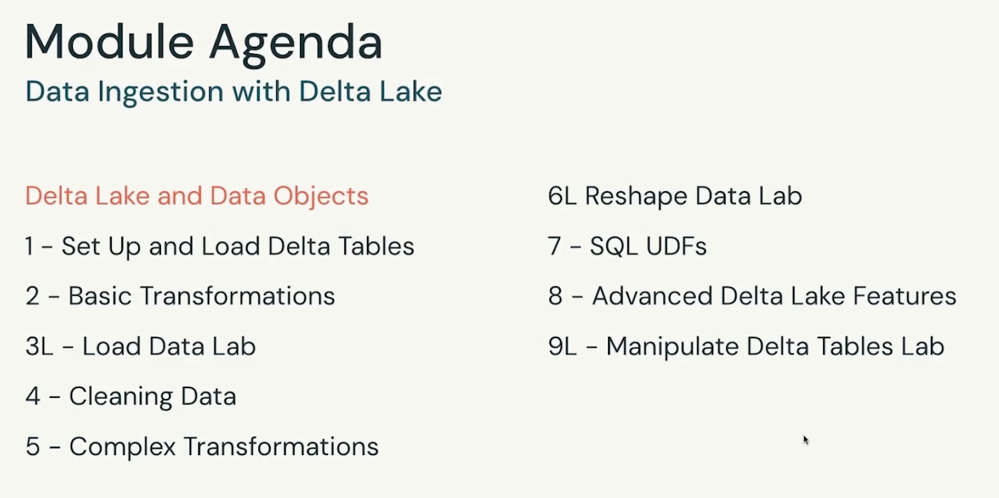
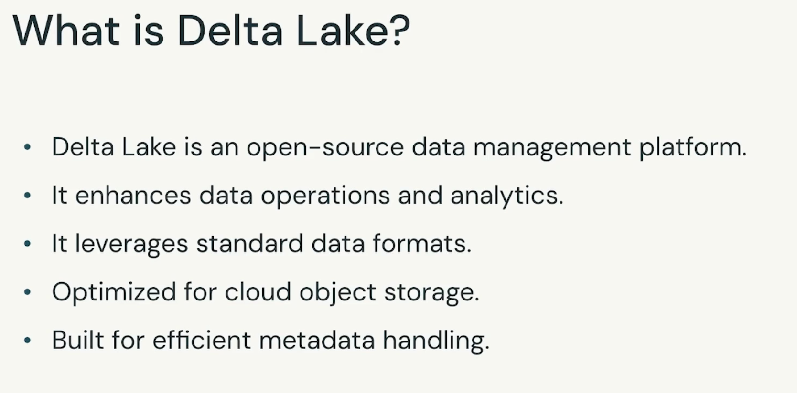
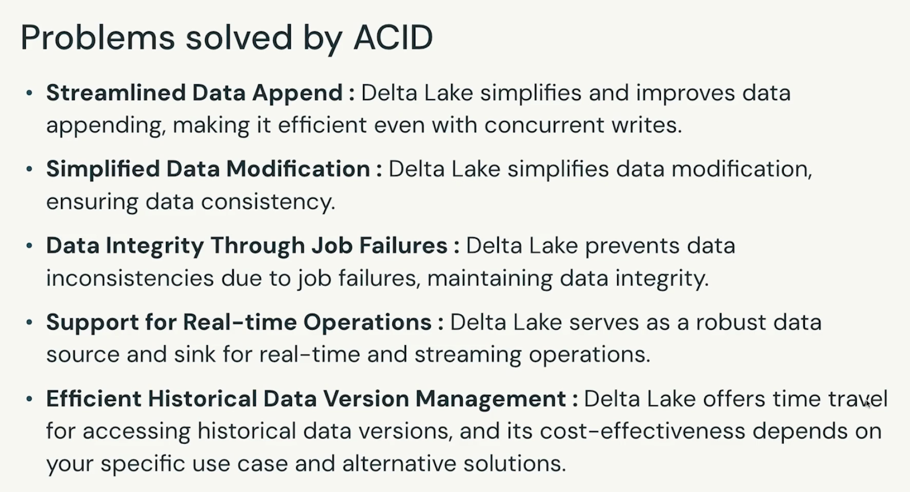
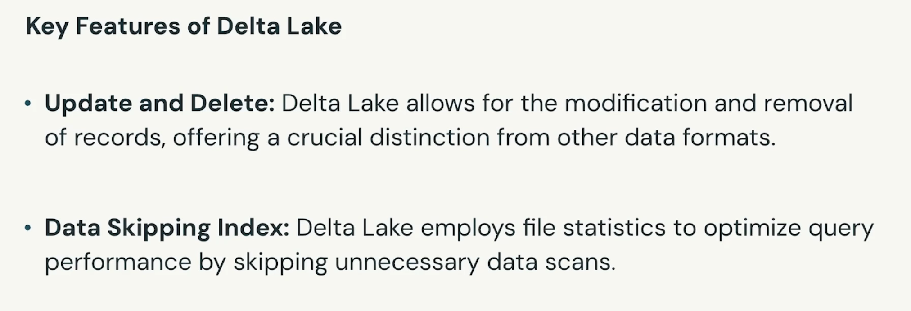
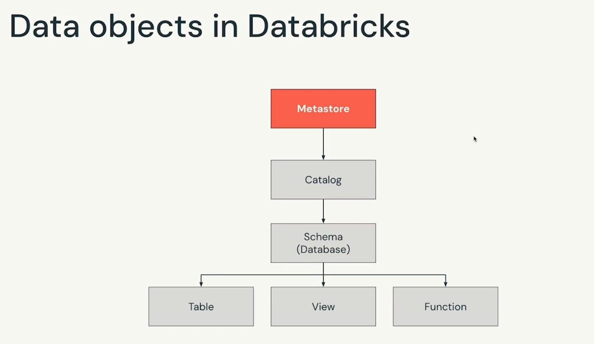
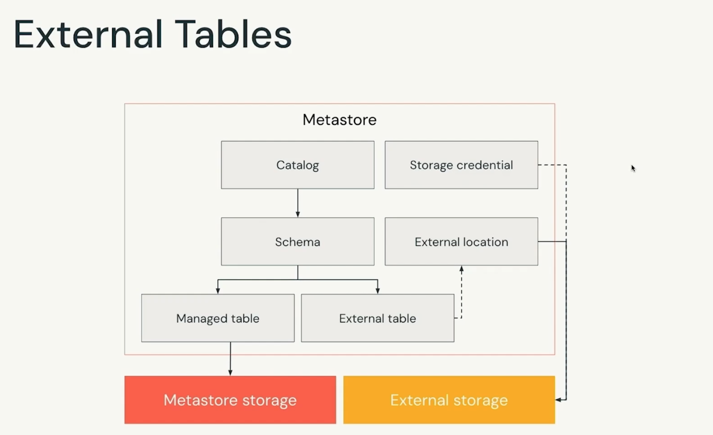
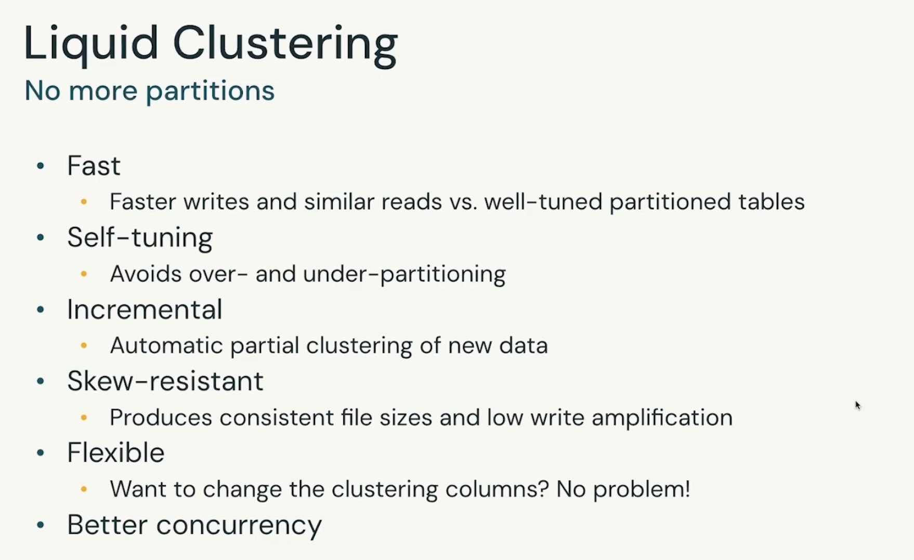
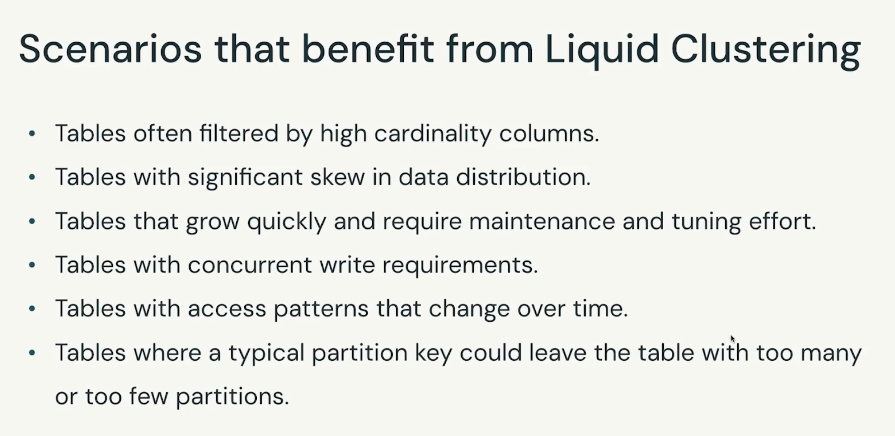
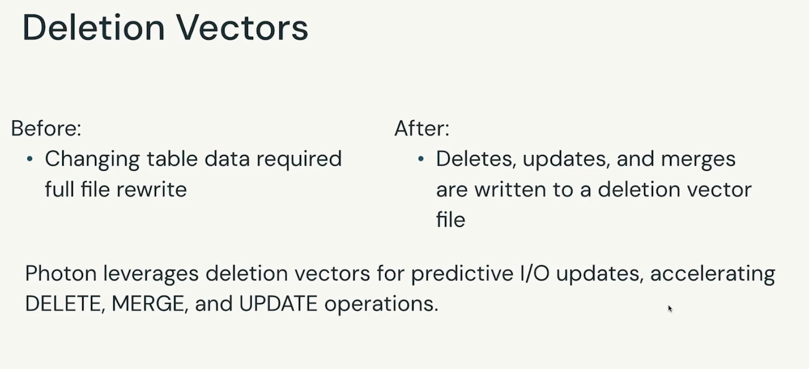
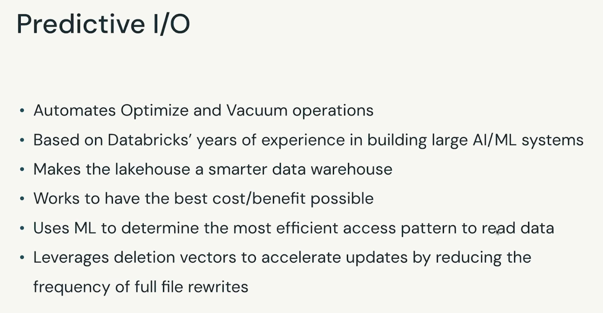

# Databricks learning notes

## Databricks associate certification prep
**databricks partner academy**
### Module 1: Data Ingestion with Delta Lake

#### Module agenda

**Delta Lake - open-source project that enables building data lakehouse on top of an existing cloud storage

**delta lake is the default format for table created in databricks**

    * Tables:
        + Managed tables
        + Extexnal/unmanaged tables

**code.ipynb read**

### Module 2: Nested data

**Nested data:**
* Spark SQL has built-in funcationality to directly interact with nested data stored as JSON strings or struct types.
* `:` use to access subfield in JSON strings
* `.` use to access subfield in struct types

* schema_of_json() - derived schema from json string
* from_json() - parses a column containing a json string into a struct type using the specified schema.

**Creating a temp view** 
CREATE OR REPLACE TEMP VIEW parsed_events AS SELECT json.* from (select from_json(value, schema) as json from events_strings);

**Manipulative arrays:** 
explode() - separates the elements of an array into multiple rows;
size() - provides a count for the # elements in an array for each row.

**Nesting functions** 
collect_set() - use to collect all unique values in a group, including arrays.  
eg. select user_id, collect_set(items.item_id) as cart_history from exploded_events  group by user_id  order by user_id

 
array_distinct - to remove duplicates. 
eg. array_distinct(flatten(collect_set(items.item_id))) as cart_history

**SQL UDFs and control flow:**
UDF allow to register custom SQL logic as functions in a db. 
eg. CREATE OR REPLACE FUNCTION sale(item STRING, price INT)
RETURNS string
RETURN CONCAT("the", item, "is on sale at $", round(price*0.8,0))

* scoping and permissions of SQL UDF:
    * persist b/w execution env (include NBs, queries & jobs)
    * exists as objects in the metastore and are governed by the same table acls as db, tables, views.
    * to create a udf, use catalog, schema and create function
    * to use a udf, use catalog, schema and execute on the function.

DESCRIBE function - to see whr a function was registered and basic info about expected i/o's (use describe function extended - for detailed info)

Delta time reversal
SELECT * FROM students VERSION AS of 3;

Rollback versions
RESTORE TABLE students TO VERSION AS of 8;

### Module 4: Controlling Access to data

* Column Masking:
    * CREATE OR REPLACE FUNCTION mrn_mask(mrn STRING) RETURN
    case when is_member('metastore_admins) then mrn
    else 'REDACTED'
    END;

    ALTER TABLE silver ALTER COLUMN mrn SET MASK mrn_mask;

    -- to drop the mask 
    ALTER TABLE silver ALTER COLUMN mrn DROP MASK;

    -- ROW FILTER 
    CREATE OR REPLACE FUNCTION device_filter(device_id int) return if(IS_ACCOUNT_GROUP_MEMBER('admin'),true, device_id<30);

    ALTER TABLE silver SET ROW FILTER device_filter on (device_id);

    -- Protecting columns with dynamic views
    CREATE OR REPLACE VIEW protected_view AS SELECT case when IS_ACCOUNT_GROUP_MEMBER('metastore_admins') then mrn else 'REDACTED' end as mrn, case when IS_ACCOUNT_GROUP_MEMBER('metastore_admins') then name else 'REDACTED' end as name, mean(heartrate) as avg_heartrate from silver group by mrn, name, DATE_TRUNC("DD", time);

    Grant select on view protected_view to `account_users`;

    -- restricted rows
    CREATE OR REPLACE VIEW vw_gold as select * from silver where case when is_account_group_member('metastore_admins') then True else device_id<30 end;

    grant select on vw_gold to `account_users`;

    --Data Masking
    CREATE OR REPLACE FUNCTION mask_credit_card(credit_card STRING) RETURNS STRING RETURN concat(LEFT(X,2), REPEAT("*", length(x)-2));

    create or replace view vw_gold as select case when is_account_group_member('metastore_admins') then mrn
    else mask_credit_card(mrn)
    end as mrn
    from silver where case when is_account_group_member('metastore_admins') then True else device_id < 30 end;

    grant select on view vw_gold to `account_users`;
